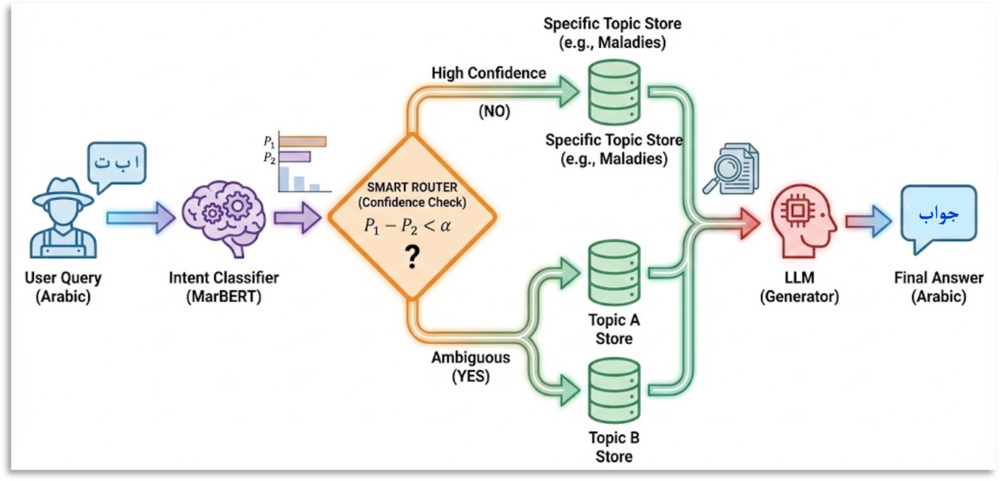
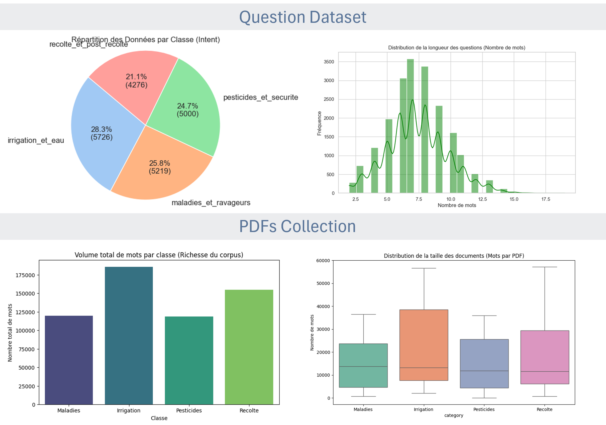
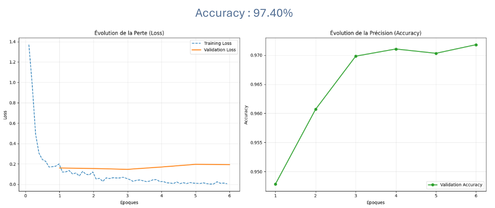

# AgriAssist 🌿🤖
### Assistant Agricole Intelligent basé sur l'IA (NLP & RAG)


**AgriAssist** est un chatbot intelligent en langue arabe conçu pour aider les agriculteurs. Il combine des techniques avancées de **Deep Learning (MarBERT)** pour la classification d'intentions et une architecture **RAG (Retrieval-Augmented Generation)** optimisée par un mécanisme de "Soft Routing" (Routage Sémantique).

---

## 🏗️ Architecture du Système

Le cœur de l'innovation réside dans le **Smart Router**. Contrairement à un RAG classique qui cherche dans toute la base documentaire, AgriAssist identifie l'intention de l'utilisateur (Maladie, Irrigation, etc.) et ne consulte que les documents pertinents, réduisant ainsi le bruit et augmentant la précision.


*Figure 1 : Pipeline de traitement : Classification, Routage Intelligent et Génération RAG.*

---

## 📊 Données et Analyse (EDA)

Le projet s'appuie sur un dataset robuste construit spécifiquement pour le domaine agricole arabe.

* **Dataset de Questions :** +20,000 questions générées et augmentées, réparties sur 4 classes (Irrigation, Maladies, Pesticides, Récolte).
* **Corpus RAG :** Collection de documents techniques PDF segmentés et indexés.


*Figure 2 : Distribution des classes, longueur des questions et analyse du corpus documentaire.*

---

## 🧠 Modélisation et Expérimentation

Nous avons adopté une approche de recherche comparative pour valider nos choix techniques.

### 1. Baseline : Machine Learning Classique (SVM)
Nous avons d'abord entraîné un modèle SVM (Support Vector Machine) avec TF-IDF comme point de référence.
* **Résultat :** Accuracy de **94.22%**.
* **Observation :** Très performant mais montre des limites sur les phrases ambiguës ou dialectales complexes.


### 2. État de l'Art : Deep Learning (MarBERT)
Nous avons réalisé un Fine-Tuning du modèle **UBC-NLP/MarBERT** (spécialisé pour l'arabe et ses dialectes).
* **Résultat :** Accuracy de **97.40%**.
* **Avantage :** Meilleure compréhension du contexte et gestion supérieure du "Rappel" (Recall) sur toutes les classes.


*Figure 3 : Courbes d'apprentissage (Loss & Accuracy) du modèle MarBERT.*

---

## 💻 Démonstration (Interface)

L'application finale offre une interface utilisateur conviviale et un terminal de trace pour visualiser le processus de décision de l'IA (Classification -> Routing -> Retrieval).


*Figure 4 : À gauche, le Chatbot répond à une question sur les maladies. À droite, le terminal backend montre le score de confiance (54.6%) et les documents récupérés.*

---

## 🚀 Installation et Utilisation

### Prérequis
* Python 3.8+
* GPU recommandé pour l'inférence rapide (CUDA)

### Installation

1.  **Cloner le dépôt :**
    ```bash
    git clone [https://github.com/votre-username/AgriAssist.git](https://github.com/votre-username/AgriAssist.git)
    cd AgriAssist
    ```

2.  **Installer les dépendances :**
    ```bash
    pip install -r requirements.txt
    ```

3.  **Lancer l'application :**
    ```bash
    streamlit run app.py
    ```

---

## 🛠️ Stack Technique

* **Langage :** Python
* **NLP & ML :** PyTorch, Hugging Face Transformers, Scikit-Learn
* **Vector Store :** ChromaDB / FAISS
* **LLM :** Meta Llama 3 (via API/Local)
* **Frontend :** Streamlit

## 🔮 Perspectives

* Intégration de la reconnaissance vocale (Speech-to-Text) pour les dialectes maghrébins.
* Module de Vision par Ordinateur pour la détection de maladies par photo.

---

**Auteur :** Hamouchi Omar
**Encadrant :** Pr. Zeroual Imad
**Master :** Systèmes d'Information Décisionnels et Imagerie